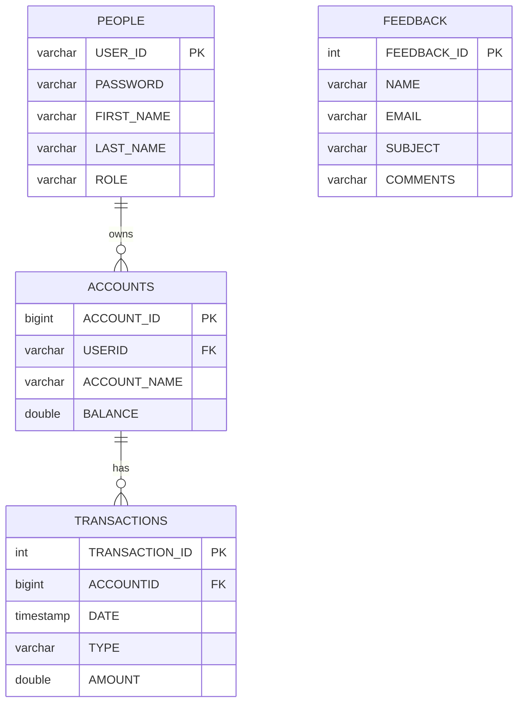
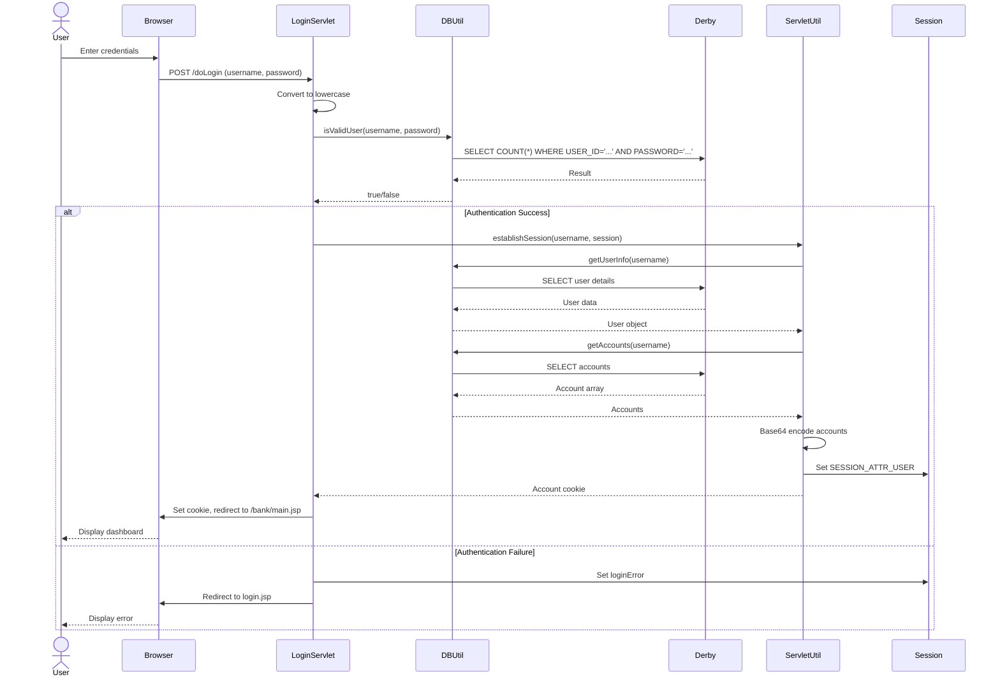
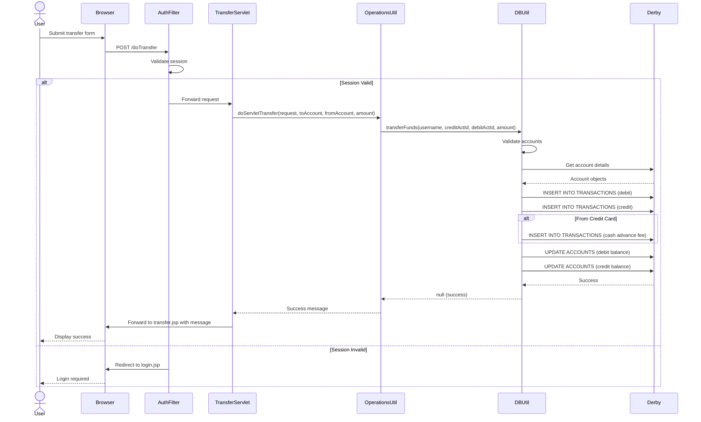
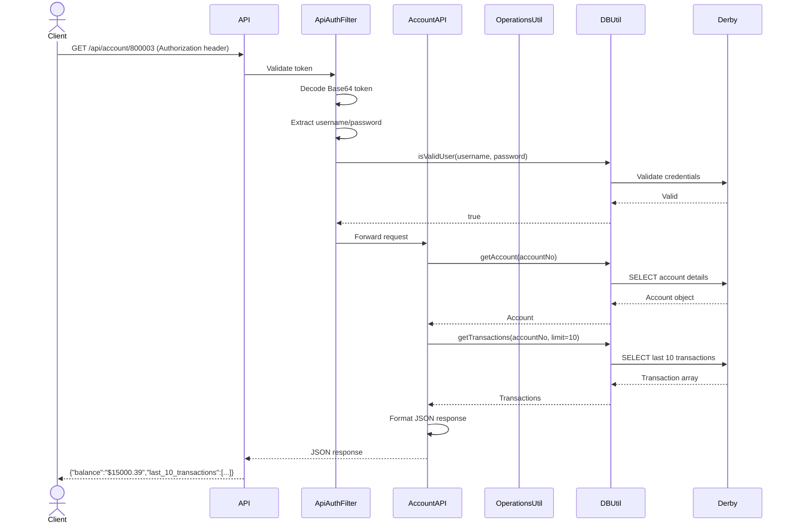
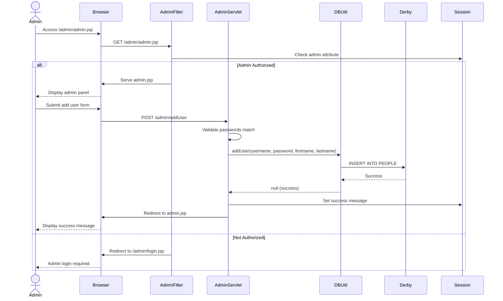

# AltoroMutual Banking Application - Architecture Documentation

## 1. Executive Summary

AltoroMutual (AltoroJ) is a deliberately vulnerable J2EE banking web application designed for security testing, training, and demonstration purposes. Built using traditional Java Servlets and JSP without modern frameworks, it simulates a realistic online banking system with features including user authentication, account management, fund transfers, transaction history, and administrative functions. The application uses Apache Derby as an embedded database and provides both a web interface and a comprehensive REST API documented with Swagger. AltoroJ intentionally contains security vulnerabilities aligned with the OWASP Top 10 to serve as a practical learning platform for application security professionals.

## 2. System Architecture

### High-Level Architecture Diagram

```mermaid
graph TB
    subgraph "Client Layer"
        Browser[Web Browser]
        APIClient[REST API Client]
        SwaggerUI[Swagger UI]
    end

    subgraph "Presentation Layer"
        JSP[JSP Pages<br/>login.jsp, main.jsp, transfer.jsp, etc.]
        StaticContent[Static Content<br/>HTML, CSS, Images, SWF]
        SwaggerDocs[Swagger Documentation<br/>properties.json, index.html]
    end

    subgraph "Security Filter Layer"
        AuthFilter[AuthFilter<br/>Session-based Auth]
        AdminFilter[AdminFilter<br/>Admin Authorization]
        ApiAuthFilter[ApiAuthFilter<br/>Token-based Auth]
    end

    subgraph "Controller Layer - Servlets"
        LoginServlet[LoginServlet<br/>/doLogin]
        TransferServlet[TransferServlet<br/>/doTransfer]
        AccountViewServlet[AccountViewServlet<br/>/showAccount]
        FeedbackServlet[FeedbackServlet<br/>/feedback]
        AdminServlet[AdminServlet<br/>/admin/*]
        AdminLoginServlet[AdminLoginServlet<br/>/admin/doLogin]
        CCApplyServlet[CCApplyServlet<br/>/bank/apply]
        SubscribeServlet[SubscribeServlet<br/>/subscribe]
        SurveyServlet[SurveyServlet<br/>/survey]
        RedirectServlet[RedirectServlet<br/>/redirect]
    end

    subgraph "Controller Layer - REST API"
        AltoroAPI[AltoroAPI<br/>JAX-RS Application<br/>@ApplicationPath /api]
        LoginAPI[LoginAPI<br/>POST /api/login]
        LogoutAPI[LogoutAPI<br/>GET /api/logout]
        AccountAPI[AccountAPI<br/>GET /api/account<br/>GET /api/account/:id<br/>GET/POST /api/account/:id/transactions]
        TransferAPI[TransferAPI<br/>POST /api/transfer]
        FeedbackAPI[FeedbackAPI<br/>POST /api/feedback/submit<br/>GET /api/feedback/:id]
        AdminAPI[AdminAPI<br/>POST /api/admin/changePassword<br/>POST /api/admin/addUser]
    end

    subgraph "Business Logic Layer"
        ServletUtil[ServletUtil<br/>- Session Management<br/>- Property Loading<br/>- Cookie Handling<br/>- XSS Validation<br/>- Search Functions]
        OperationsUtil[OperationsUtil<br/>- Transfer Operations<br/>- Feedback Processing<br/>- User Operations]
    end

    subgraph "Data Access Layer"
        DBUtil[DBUtil<br/>- Connection Management<br/>- User Authentication<br/>- Account Operations<br/>- Transaction Management<br/>- Feedback Storage<br/>- Admin Functions]
    end

    subgraph "Domain Model Layer"
        User[User<br/>- username<br/>- firstName<br/>- lastName<br/>- role<br/>- lastAccessDate]
        Account[Account<br/>- accountId<br/>- accountName<br/>- balance]
        Transaction[Transaction<br/>- transactionId<br/>- accountId<br/>- date<br/>- type<br/>- amount]
        Feedback[Feedback<br/>- feedbackId<br/>- name<br/>- email<br/>- subject<br/>- message]
    end

    subgraph "Data Storage Layer"
        Derby[(Apache Derby DB<br/>~/altoro/<br/>Tables:<br/>- PEOPLE<br/>- ACCOUNTS<br/>- TRANSACTIONS<br/>- FEEDBACK)]
        ExtDB[(External Database<br/>Optional JNDI<br/>DB2, MySQL, etc.)]
        AppProps[app.properties<br/>Configuration File]
        LogFile[Transaction Log<br/>Log4AltoroJ]
    end

    subgraph "Initialization"
        StartupListener[StartupListener<br/>ServletContextListener<br/>- Load app.properties<br/>- Initialize log file<br/>- Trigger DB creation<br/>- Configure Swagger]
    end

    Browser --> JSP
    Browser --> StaticContent
    APIClient --> AltoroAPI
    SwaggerUI --> SwaggerDocs
    SwaggerUI --> AltoroAPI
    
    JSP --> AuthFilter
    JSP --> AdminFilter
    StaticContent -.Direct Access.-> Browser
    
    AuthFilter --> LoginServlet
    AuthFilter --> TransferServlet
    AuthFilter --> AccountViewServlet
    AuthFilter --> FeedbackServlet
    AuthFilter --> CCApplyServlet
    AdminFilter --> AdminServlet
    AdminFilter --> AdminLoginServlet
    
    JSP --> SubscribeServlet
    JSP --> SurveyServlet
    JSP --> RedirectServlet
    
    AltoroAPI --> ApiAuthFilter
    ApiAuthFilter --> LoginAPI
    ApiAuthFilter --> LogoutAPI
    ApiAuthFilter --> AccountAPI
    ApiAuthFilter --> TransferAPI
    ApiAuthFilter --> FeedbackAPI
    ApiAuthFilter --> AdminAPI
    
    LoginServlet --> ServletUtil
    TransferServlet --> OperationsUtil
    AccountViewServlet --> ServletUtil
    FeedbackServlet --> OperationsUtil
    AdminServlet --> DBUtil
    CCApplyServlet --> ServletUtil
    
    LoginAPI --> ServletUtil
    AccountAPI --> OperationsUtil
    TransferAPI --> OperationsUtil
    FeedbackAPI --> OperationsUtil
    AdminAPI --> ServletUtil
    
    ServletUtil --> DBUtil
    OperationsUtil --> DBUtil
    
    DBUtil --> User
    DBUtil --> Account
    DBUtil --> Transaction
    DBUtil --> Feedback
    
    User --> Derby
    Account --> Derby
    Transaction --> Derby
    Feedback --> Derby
    DBUtil -.Optional.-> ExtDB
    
    StartupListener --> ServletUtil
    StartupListener --> DBUtil
    ServletUtil --> AppProps
    ServletUtil --> LogFile
    
    LoginServlet -.Creates.-> Session[HTTP Session<br/>User Object<br/>Admin Attribute]
    LoginServlet -.Creates.-> Cookie[AltoroAccounts Cookie<br/>Base64 Encoded]
    AuthFilter -.Validates.-> Session
    AdminFilter -.Validates.-> Session
    
    style Browser fill:#e1f5ff
    style APIClient fill:#e1f5ff
    style SwaggerUI fill:#e1f5ff
    style Derby fill:#ffe1e1
    style ExtDB fill:#ffe1e1
    style Session fill:#fff4e1
    style Cookie fill:#fff4e1
    style StartupListener fill:#e1ffe1
```



## 3. Component Descriptions

### 3.1 Presentation Layer

#### JSP Pages
- **Purpose**: Server-side rendered pages for the web interface
- **Key Pages**:
  - `index.jsp`: Landing page
  - `login.jsp`: User authentication
  - `bank/main.jsp`: Account dashboard
  - `bank/transfer.jsp`: Fund transfer interface
  - `bank/transaction.jsp`: Transaction history
  - `admin/login.jsp`: Admin authentication
  - `admin/admin.jsp`: Admin dashboard
  - `feedback.jsp`: Customer feedback form

#### Static Content
- HTML pages for informational content (about, contact, services)
- CSS stylesheets for UI presentation
- Images and multimedia assets
- Flash/SWF files (legacy components)

#### Swagger Documentation
- Interactive API documentation at `/swagger/index.html`
- Auto-configured with correct base path via `properties.json`
- Provides API testing interface

### 3.2 Security Filter Layer

#### AuthFilter
- **Path**: `src/com/ibm/security/appscan/altoromutual/filter/AuthFilter.java`
- **Purpose**: Protects authenticated user pages
- **Mechanism**: Validates `ServletUtil.SESSION_ATTR_USER` in session
- **Action**: Redirects to `login.jsp` if not authenticated

#### AdminFilter
- **Path**: `src/com/ibm/security/appscan/altoromutual/filter/AdminFilter.java`
- **Purpose**: Protects admin-only pages
- **Mechanism**: Validates admin session attribute
- **Action**: Redirects to admin login if not authorized

#### ApiAuthFilter
- **Path**: `src/com/ibm/security/appscan/altoromutual/filter/ApiAuthFilter.java`
- **Purpose**: Validates REST API requests
- **Mechanism**: Token-based authentication using Base64-encoded credentials
- **Exemptions**: Login and feedback submission endpoints

### 3.3 Controller Layer - Servlets

#### LoginServlet (`/doLogin`)
- **Methods**: GET (logout), POST (login)
- **Functionality**:
  - Validates credentials via `DBUtil.isValidUser()`
  - Converts username and password to lowercase
  - Creates session with User object
  - Generates Base64-encoded account cookie
  - Redirects to `bank/main.jsp` on success

#### TransferServlet (`/doTransfer`)
- **Methods**: GET, POST
- **Functionality**:
  - Validates user session
  - Processes fund transfers between accounts
  - Delegates to `OperationsUtil.doServletTransfer()`
  - Returns result message to `transfer.jsp`

#### AccountViewServlet (`/showAccount`)
- **Methods**: GET, POST
- **Functionality**:
  - Displays account details and balance
  - Shows transaction history
  - Supports date-range filtering

#### FeedbackServlet (`/feedback`)
- **Methods**: POST
- **Functionality**:
  - Processes customer feedback submissions
  - Stores feedback in database (if enabled)
  - Validates email format
  - XSS filtering (optional)

#### AdminServlet (`/admin/*`)
- **Endpoints**:
  - `/admin/addAccount`: Create new account
  - `/admin/addUser`: Create new user
  - `/admin/changePassword`: Update user password
- **Access Control**: Protected by AdminFilter

#### AdminLoginServlet (`/admin/doLogin`)
- **Functionality**:
  - Separate admin authentication
  - Sets `admin=altoroadmin` session attribute
  - Redirects to admin dashboard

#### Other Servlets
- **CCApplyServlet**: Credit card application processing
- **SubscribeServlet**: Newsletter subscription
- **SurveyServlet**: Customer survey handling
- **RedirectServlet**: URL redirection (potential open redirect)

### 3.4 Controller Layer - REST API

#### AltoroAPI (JAX-RS Application)
- **Path**: `@ApplicationPath("api")`
- **Configuration**: Jersey ResourceConfig
- **Package Scan**: `com.ibm.security.appscan.altoromutual.api`
- **Filter Registration**: ApiAuthFilter

#### LoginAPI (`/api/login`)
- **GET**: Check login status
- **POST**: Authenticate user
  - Request: `{"username": "user", "password": "pass"}`
  - Response: `{"success": "...", "Authorization": "token"}`
  - Token Format: Base64(Base64(username):Base64(password):random)

#### AccountAPI (`/api/account`)
- **GET /api/account**: List all user accounts
- **GET /api/account/{accountNo}**: Get account balance and last 10 transactions
- **GET /api/account/{accountNo}/transactions**: Get last 10 transactions
- **POST /api/account/{accountNo}/transactions**: Get transactions by date range
  - Request: `{"startDate": "yyyy-mm-dd", "endDate": "yyyy-mm-dd"}`

#### TransferAPI (`/api/transfer`)
- **POST /api/transfer**: Transfer funds between accounts
  - Request: `{"fromAccount": "123", "toAccount": "456", "transferAmount": "100.00"}`
  - Response: `{"success": "message"}` or `{"error": "message"}`

#### FeedbackAPI (`/api/feedback`)
- **POST /api/feedback/submit**: Submit feedback (no auth required)
  - Request: `{"name": "...", "email": "...", "subject": "...", "message": "..."}`
  - Response: `{"status": "Thank you!", "feedbackId": "1234"}`
- **GET /api/feedback/{feedbackId}**: Retrieve feedback by ID

#### AdminAPI (`/api/admin`)
- **POST /api/admin/changePassword**: Change user password
  - Request: `{"username": "...", "password1": "...", "password2": "..."}`
  - Requires: `enableAdminFunctions=true` in app.properties
- **POST /api/admin/addUser**: Create new user
  - Request: `{"firstname": "...", "lastname": "...", "username": "...", "password1": "...", "password2": "..."}`

#### LogoutAPI (`/api/logout`)
- **GET /api/logout**: Terminate API session

### 3.5 Business Logic Layer

#### ServletUtil
- **Session Management**:
  - `establishSession()`: Creates user session and account cookie
  - `isLoggedin()`: Validates user authentication
  - `getUser()`: Retrieves User object from session
- **Property Management**:
  - `initializeAppProperties()`: Loads `app.properties`
  - `getAppProperty()`: Retrieves property value
  - `isAppPropertyTrue()`: Boolean property check
- **Utility Functions**:
  - `sanitizeWeb()`: HTML encoding (using StringEscapeUtils)
  - `sanitzieHtmlWithRegex()`: Regex-based XSS filtering
  - `searchArticles()`: XML-based news search
  - `searchSite()`: File system search
- **REST API Initialization**:
  - `initializeRestAPI()`: Updates Swagger base path

#### OperationsUtil
- **Transfer Operations**:
  - `doServletTransfer()`: Web interface transfers
  - `doApiTransfer()`: REST API transfers
- **Feedback Processing**:
  - `sendFeedback()`: Store feedback in database
- **User Operations**:
  - `getUser()`: Extract user from request
  - `makeRandomString()`: Generate random tokens

### 3.6 Data Access Layer

#### DBUtil
- **Connection Management**:
  - Singleton pattern for connection pooling
  - Derby embedded driver: `jdbc:derby:~/altoro/`
  - Optional external JNDI datasource support
  - Auto-initialization on first access

- **User Operations**:
  - `isValidUser(username, password)`: Authenticate user (SQL injection vulnerable)
  - `getUserInfo(username)`: Retrieve user details
  - `addUser()`: Create new user
  - `changePassword()`: Update user password
  - `getBankUsernames()`: List all users

- **Account Operations**:
  - `getAccounts(username)`: Get user's accounts
  - `getAccount(accountNo)`: Get specific account
  - `addAccount()`: Create new account

- **Transaction Operations**:
  - `transferFunds()`: Execute fund transfer
  - `getTransactions()`: Query transaction history
  - Automatic cash advance fee calculation ($2.50)

- **Feedback Operations**:
  - `storeFeedback()`: Save feedback to database
  - `getFeedback()`: Retrieve feedback by ID

- **Database Initialization**:
  - `initDB()`: Create tables and seed data
  - Triggered on first login or via `database.reinitializeOnStart`

### 3.7 Domain Model Layer

#### User
- **Attributes**: username, firstName, lastName, role (User/Admin), lastAccessDate
- **Methods**:
  - `getAccounts()`: Retrieve user's accounts
  - `lookupAccount()`: Find specific account
  - `getCreditCardNumber()`: Get credit card account ID
  - `getUserTransactions()`: Get transaction history

#### Account
- **Attributes**: accountId, accountName, balance
- **Static Methods**:
  - `getAccount(accountNo)`: Retrieve account from database
  - `toBase64List()`: Encode accounts for cookie
  - `fromBase64List()`: Decode accounts from cookie
- **Account Types**: Checking, Savings, Credit Card

#### Transaction
- **Attributes**: transactionId, accountId, date, transactionType, amount
- **Transaction Types**: Deposit, Withdrawal, Payment, Cash Advance, Cash Advance Fee

#### Feedback
- **Attributes**: feedbackId, name, email, subject, message
- **Constant**: `FEEDBACK_ALL = -1` (retrieve all feedback)

## 4. API Reference

### REST API Endpoints

| Endpoint | Method | Auth Required | Purpose | Request Body | Response |
|----------|--------|---------------|---------|--------------|----------|
| `/api/login` | POST | No | Authenticate user | `{"username":"user","password":"pass"}` | `{"success":"...","Authorization":"token"}` |
| `/api/login` | GET | Yes | Check login status | - | `{"loggedin":"true"}` |
| `/api/logout` | GET | Yes | Logout user | - | Success message |
| `/api/account` | GET | Yes | List all accounts | - | `{"Accounts":[{"Name":"...","id":"..."}]}` |
| `/api/account/{id}` | GET | Yes | Get account details | - | `{"balance":"...","last_10_transactions":[...]}` |
| `/api/account/{id}/transactions` | GET | Yes | Get last 10 transactions | - | `{"last_10_transactions":[...]}` |
| `/api/account/{id}/transactions` | POST | Yes | Get transactions by date | `{"startDate":"yyyy-mm-dd","endDate":"yyyy-mm-dd"}` | `{"transactions":[...]}` |
| `/api/transfer` | POST | Yes | Transfer funds | `{"fromAccount":"123","toAccount":"456","transferAmount":"100"}` | `{"success":"..."}` or `{"error":"..."}` |
| `/api/feedback/submit` | POST | No | Submit feedback | `{"name":"...","email":"...","subject":"...","message":"..."}` | `{"status":"...","feedbackId":"..."}` |
| `/api/feedback/{id}` | GET | Yes | Get feedback by ID | - | `{"name":"...","email":"...","subject":"...","message":"..."}` |
| `/api/admin/changePassword` | POST | Yes | Change user password | `{"username":"...","password1":"...","password2":"..."}` | `{"success":"..."}` or `{"error":"..."}` |
| `/api/admin/addUser` | POST | Yes | Create new user | `{"firstname":"...","lastname":"...","username":"...","password1":"...","password2":"..."}` | `{"success":"..."}` or `{"error":"..."}` |

### Authentication

**Web Interface**: Session-based
- Session attribute: `ServletUtil.SESSION_ATTR_USER`
- Cookie: `AltoroAccounts` (Base64-encoded account list)

**REST API**: Token-based
- Header: `Authorization: <Base64-encoded-token>`
- Token format: `Base64(Base64(username):Base64(password):randomString)`
- Generated on successful login

## 5. Servlet Reference

### Web Application Endpoints

| Servlet | URL Pattern | Method | Auth Required | Purpose |
|---------|-------------|--------|---------------|---------|
| LoginServlet | `/doLogin` | POST | No | User login |
| LoginServlet | `/doLogin` | GET | No | User logout |
| TransferServlet | `/doTransfer` | POST | Yes | Fund transfer |
| AccountViewServlet | `/showAccount` | GET/POST | Yes | View account details |
| FeedbackServlet | `/feedback` | POST | No | Submit feedback |
| AdminLoginServlet | `/admin/doLogin` | POST | No | Admin login |
| AdminServlet | `/admin/addAccount` | POST | Admin | Create account |
| AdminServlet | `/admin/addUser` | POST | Admin | Create user |
| AdminServlet | `/admin/changePassword` | POST | Admin | Change password |
| CCApplyServlet | `/bank/apply` | POST | Yes | Credit card application |
| SubscribeServlet | `/subscribe` | POST | No | Newsletter subscription |
| SurveyServlet | `/survey` | POST | No | Submit survey |
| RedirectServlet | `/redirect` | GET | No | URL redirection |

### Filter Mappings

- **AuthFilter**: `/bank/*` (all authenticated pages)
- **AdminFilter**: `/admin/*` (admin pages only)
- **ApiAuthFilter**: `/api/*` (all API endpoints except login/feedback)

## 6. Data Model

### Entity-Relationship Diagram



### Database Schema Details

#### PEOPLE Table
- **Primary Key**: USER_ID (VARCHAR 50)
- **Columns**:
  - PASSWORD (VARCHAR 20) - Stored in plaintext
  - FIRST_NAME (VARCHAR 100)
  - LAST_NAME (VARCHAR 100)
  - ROLE (VARCHAR 50) - Values: 'user', 'admin'
- **Default Users**:
  - admin/admin (Admin)
  - jsmith/demo1234 (User)
  - jdoe/demo1234 (User)
  - sspeed/demo1234 (User)
  - tuser/tuser (User)

#### ACCOUNTS Table
- **Primary Key**: ACCOUNT_ID (BIGINT, auto-increment starting at 800000)
- **Foreign Key**: USERID → PEOPLE.USER_ID
- **Columns**:
  - ACCOUNT_NAME (VARCHAR 100) - 'Checking', 'Savings', 'Credit Card'
  - BALANCE (DOUBLE)
- **Special Accounts**: Credit cards use fixed IDs (e.g., 4539082039396288)

#### TRANSACTIONS Table
- **Primary Key**: TRANSACTION_ID (INTEGER, auto-increment starting at 2311)
- **Foreign Key**: ACCOUNTID → ACCOUNTS.ACCOUNT_ID
- **Columns**:
  - DATE (TIMESTAMP)
  - TYPE (VARCHAR 100) - 'Deposit', 'Withdrawal', 'Payment', 'Cash Advance', 'Cash Advance Fee'
  - AMOUNT (DOUBLE) - Negative for debits, positive for credits

#### FEEDBACK Table
- **Primary Key**: FEEDBACK_ID (INTEGER, auto-increment starting at 1022)
- **Columns**:
  - NAME (VARCHAR 100)
  - EMAIL (VARCHAR 50)
  - SUBJECT (VARCHAR 100)
  - COMMENTS (VARCHAR 500)

### Relationships

1. **User → Accounts**: One-to-Many
   - A user can have multiple accounts (checking, savings, credit card)
   - Each account belongs to exactly one user

2. **Account → Transactions**: One-to-Many
   - An account can have multiple transactions
   - Each transaction belongs to exactly one account

3. **Feedback**: Independent entity
   - No foreign key relationships
   - Stores customer feedback submissions

## 7. Transaction Flows

### 7.1 User Login Flow



### 7.2 Fund Transfer Flow



### 7.3 Balance Inquiry Flow (REST API)



### 7.4 Admin Operations Flow



## 8. Security Model

### 8.1 Authentication Mechanisms

#### Web Interface Authentication
- **Method**: Session-based
- **Process**:
  1. User submits credentials to `/doLogin`
  2. Credentials converted to lowercase
  3. SQL query validates credentials (vulnerable to SQL injection)
  4. User object stored in session with key `ServletUtil.SESSION_ATTR_USER`
  5. Base64-encoded account list stored in `AltoroAccounts` cookie
- **Session Attributes**:
  - `user`: User object
  - `admin`: "altoroadmin" (for admin users)
  - `loginError`: Error message on failed login

#### REST API Authentication
- **Method**: Token-based
- **Process**:
  1. Client POSTs credentials to `/api/login`
  2. Server validates credentials
  3. Server generates token: `Base64(Base64(username):Base64(password):randomString)`
  4. Client includes token in `Authorization` header for subsequent requests
  5. ApiAuthFilter decodes and validates token on each request
- **Token Format**: Three Base64-encoded segments separated by colons
- **Token Validation**: Extracts username/password and re-validates against database

### 8.2 Authorization Model

#### User Roles
1. **User** (role='user'):
   - Access to own accounts
   - View transactions
   - Transfer funds
   - Submit feedback
   - Apply for credit cards

2. **Admin** (role='admin'):
   - All user privileges
   - Add/modify users
   - Add accounts
   - Change passwords
   - View all feedback
   - Requires `enableAdminFunctions=true` in app.properties

#### Access Control Filters

**AuthFilter** (`/bank/*`):
- Validates presence of User object in session
- Redirects to `/login.jsp` if not authenticated
- Applied to all authenticated user pages

**AdminFilter** (`/admin/*`):
- Validates admin session attribute
- Checks for `admin=altoroadmin` in session
- Redirects to `/admin/login.jsp` if not authorized

**ApiAuthFilter** (`/api/*`):
- Validates Authorization header token
- Exempts `/api/login` and `/api/feedback/submit`
- Returns 401 Unauthorized if invalid

### 8.3 Admin Privilege Escalation

#### Admin Login Process
1. User accesses `/admin/login.jsp`
2. Submits credentials to `/admin/doLogin`
3. AdminLoginServlet validates credentials
4. Sets session attribute: `admin=altoroadmin`
5. Redirects to `/admin/admin.jsp`

#### Admin Function Gating
- Admin functions require `enableAdminFunctions=true` in `app.properties`
- Without this property, admin operations return errors
- Applies to both web interface and REST API

### 8.4 Security Vulnerabilities (By Design)

The application intentionally contains the following vulnerabilities for training purposes:

1. **SQL Injection** (Critical):
   - Location: `DBUtil.isValidUser()` line 207
   - Direct string concatenation in SQL queries
   - Example: `SELECT COUNT(*) FROM PEOPLE WHERE USER_ID = '` + user + `' AND PASSWORD='` + password + `'`

2. **Weak Password Storage** (Critical):
   - Passwords stored in plaintext in database
   - No hashing or encryption

3. **Password Downcase** (High):
   - Location: `LoginServlet.java` line 68
   - All passwords converted to lowercase before validation
   - Reduces password entropy

4. **Cross-Site Scripting (XSS)** (High):
   - Insufficient output encoding in JSP pages
   - Optional XSS filtering can be bypassed
   - Stored XSS in feedback system

5. **Insecure Direct Object References** (High):
   - Account IDs exposed in URLs and API responses
   - No authorization check for account access in API
   - Example: `/api/account/800003` accessible without ownership validation

6. **Session Management Issues** (Medium):
   - Predictable session handling
   - Base64 encoding (not encryption) for sensitive data
   - Session fixation vulnerabilities

7. **Command Injection** (Critical):
   - Location: `advancedStaticPageProcessing` property
   - Enables OS command execution via file lookup

8. **Path Traversal** (High):
   - File operations without proper validation
   - Directory traversal in search functionality

9. **Information Disclosure** (Medium):
   - Verbose error messages expose system details
   - Stack traces visible to users
   - Database structure revealed in errors

10. **Missing Function Level Access Control** (High):
    - Admin functions accessible without proper authorization checks
    - API endpoints lack ownership validation

## 9. Functional Requirements

### 9.1 User Operations

#### Account Management
- **FR-1**: Users shall be able to view all their accounts (checking, savings, credit card)
- **FR-2**: Users shall be able to view account balances
- **FR-3**: Users shall be able to view transaction history with date filtering
- **FR-4**: Users shall be able to apply for new credit cards

#### Fund Transfers
- **FR-5**: Users shall be able to transfer funds between their own accounts
- **FR-6**: Users shall be able to transfer funds to other users' accounts
- **FR-7**: System shall apply $2.50 cash advance fee for credit card withdrawals
- **FR-8**: System shall record all transactions with timestamp and type

#### Authentication & Session
- **FR-9**: Users shall authenticate with username and password
- **FR-10**: System shall maintain user session after successful login
- **FR-11**: Users shall be able to logout
- **FR-12**: System shall redirect unauthenticated users to login page

#### Feedback & Communication
- **FR-13**: Users shall be able to submit feedback without authentication
- **FR-14**: System shall store feedback with name, email, subject, and message
- **FR-15**: Users shall be able to subscribe to newsletters
- **FR-16**: Users shall be able to complete surveys

#### Information Access
- **FR-17**: Users shall be able to search news articles
- **FR-18**: Users shall be able to browse static informational pages
- **FR-19**: Users shall be able to view investment information
- **FR-20**: Users shall be able to access privacy and security policies

### 9.2 Administrator Operations

#### User Management
- **FR-21**: Admins shall be able to create new users with username, password, first name, and last name
- **FR-22**: Admins shall be able to change user passwords
- **FR-23**: Admins shall be able to view list of all users
- **FR-24**: Admin functions require `enableAdminFunctions=true` configuration

#### Account Management
- **FR-25**: Admins shall be able to create new accounts for existing users
- **FR-26**: Admins shall be able to specify account type (checking, savings, credit card)

#### Feedback Management
- **FR-27**: Admins shall be able to view all submitted feedback
- **FR-28**: Admins shall be able to view individual feedback details

#### System Administration
- **FR-29**: Admins shall authenticate via separate admin login
- **FR-30**: Admin session requires both user authentication and admin privilege

### 9.3 REST API Operations

#### API Authentication
- **FR-31**: API clients shall authenticate via POST to `/api/login`
- **FR-32**: System shall return authorization token on successful login
- **FR-33**: API clients shall include token in Authorization header
- **FR-34**: System shall validate token on each API request

#### API Account Operations
- **FR-35**: API shall provide endpoint to list all user accounts
- **FR-36**: API shall provide endpoint to get account balance and transactions
- **FR-37**: API shall provide endpoint to query transactions by date range
- **FR-38**: API shall limit transaction results to 100 entries

#### API Transfer Operations
- **FR-39**: API shall provide endpoint to transfer funds
- **FR-40**: API shall validate account ownership before transfer
- **FR-41**: API shall return success or error message

#### API Feedback Operations
- **FR-42**: API shall provide endpoint to submit feedback without authentication
- **FR-43**: API shall provide endpoint to retrieve feedback by ID

#### API Admin Operations
- **FR-44**: API shall provide endpoint to change user passwords
- **FR-45**: API shall provide endpoint to create new users
- **FR-46**: API admin operations require `enableAdminFunctions=true`

### 9.4 System Operations

#### Database Management
- **FR-47**: System shall auto-create Derby database on first login
- **FR-48**: System shall initialize database with default users and accounts
- **FR-49**: System shall support external database via JNDI datasource
- **FR-50**: System shall optionally reinitialize database on startup

#### Configuration Management
- **FR-51**: System shall load configuration from `app.properties` on startup
- **FR-52**: System shall support enabling/disabling dangerous features via properties
- **FR-53**: System shall initialize transaction log file with sample data

#### API Documentation
- **FR-54**: System shall provide Swagger UI for API documentation
- **FR-55**: System shall auto-configure Swagger base path on startup
- **FR-56**: Swagger UI shall provide interactive API testing interface

## 10. Database Architecture

### 10.1 Database Technology

**Apache Derby Embedded Database**
- **Version**: 10.8.2.2
- **Driver**: `org.apache.derby.jdbc.EmbeddedDriver`
- **Protocol**: `jdbc:derby:`
- **Location**: `~/altoro/` (user home directory)
- **Connection**: Singleton pattern via `DBUtil`

### 10.2 Database Initialization

#### Automatic Initialization
```
Startup → StartupListener.contextInitialized()
       → DBUtil.isValidUser("bogus", "user")
       → DBUtil.getConnection()
       → DriverManager.getConnection("jdbc:derby:altoro")
       → SQLException (error code 40000 = database not found)
       → DriverManager.getConnection("jdbc:derby:altoro;create=true")
       → DBUtil.initDB()
       → Create tables and seed data
```

#### Manual Reinitialization
Set in `app.properties`:
```properties
database.reinitializeOnStart=true
```

This forces database recreation on every Tomcat restart.

### 10.3 External Database Support

#### Configuration
1. Configure JNDI datasource in Tomcat's `context.xml`:
```xml
<Resource name="jdbc/AltoroDB" 
          auth="Container"
          type="javax.sql.DataSource"
          driverClassName="com.ibm.db2.jcc.DB2Driver"
          url="jdbc:db2://localhost:50000/altoro"
          username="db2admin"
          password="password"/>
```

2. Set in `app.properties`:
```properties
database.alternateDataSource=jdbc/AltoroDB
database.reinitializeOnStart=true
```

3. Add JDBC driver JAR to Tomcat's lib folder

#### Supported Databases
- IBM DB2
- MySQL
- PostgreSQL
- Oracle
- Any JDBC-compliant database

### 10.4 Connection Management

**Singleton Pattern**:
- Single `DBUtil` instance per application
- Single `Connection` object reused across requests
- Connection auto-reconnects if closed
- No connection pooling (single connection)

**Connection Lifecycle**:
```java
private static Connection getConnection() throws SQLException {
    if (instance == null)
        instance = new DBUtil();
    
    if (instance.connection == null || instance.connection.isClosed()) {
        // Reconnect logic
    }
    
    return instance.connection;
}
```

### 10.5 Data Seeding

#### Default Users
```sql
INSERT INTO PEOPLE (USER_ID, PASSWORD, FIRST_NAME, LAST_NAME, ROLE) VALUES
('admin', 'admin', 'Admin', 'User', 'admin'),
('jsmith', 'demo1234', 'John', 'Smith', 'user'),
('jdoe', 'demo1234', 'Jane', 'Doe', 'user'),
('sspeed', 'demo1234', 'Sam', 'Speed', 'user'),
('tuser', 'tuser', 'Test', 'User', 'user');
```

#### Default Accounts
- Admin: Corporate ($52,394,783.61), Checking ($93,820.44)
- jsmith: Savings ($10,000.42), Checking ($15,000.39), Credit Card ($100.42)
- jdoe: Savings ($10.00), Checking ($25.00), Credit Card ($10,000.97)
- sspeed: Savings ($59,102.00), Checking ($150.00)

#### Sample Transactions
- 19 pre-seeded transactions between accounts
- Date range: 2017-2019
- Various transaction types (deposits, withdrawals, transfers)

### 10.6 app.properties Configuration System

#### Property File Location
`WebContent/WEB-INF/app.properties`

#### Loading Mechanism
```java
ServletUtil.initializeAppProperties(ServletContext)
→ Read /WEB-INF/app.properties
→ Parse key=value pairs
→ Store in HashMap<String, String>
→ Access via ServletUtil.getAppProperty(String)
```

#### Available Properties

**Behavior Settings**:
```properties
# Enable admin functions (add users, change passwords)
enableAdminFunctions=true

# Change special links in navigation
specialLink=http://www.example.com

# Enable OS command execution for file lookup
advancedStaticPageProcessing=true

# Store feedback in database
enableFeedbackRetention=true
```

**Database Settings**:
```properties
# External database JNDI name
database.alternateDataSource=jdbc/AltoroDB

# Force DB reinitialization on startup
database.reinitializeOnStart=true
```

#### Property Access Patterns
```java
// Get property value (returns "" if not set)
String value = ServletUtil.getAppProperty("enableAdminFunctions");

// Check boolean property
boolean enabled = ServletUtil.isAppPropertyTrue("enableAdminFunctions");
```

#### Security Implications
- All properties are commented out by default
- Uncommenting enables dangerous features
- No authentication required to enable features
- Properties loaded once at startup (requires restart to change)

## 11. Non-Functional Requirements

### 11.1 Performance

#### Response Time
- **NFR-1**: Login operations shall complete within 2 seconds under normal load
- **NFR-2**: Account balance queries shall complete within 1 second
- **NFR-3**: Fund transfers shall complete within 3 seconds
- **NFR-4**: Transaction history queries shall complete within 2 seconds for up to 100 transactions

#### Throughput
- **NFR-5**: System shall support up to 50 concurrent users (limited by single DB connection)
- **NFR-6**: API shall handle up to 100 requests per minute per endpoint
- **NFR-7**: Database shall support up to 10,000 transactions without performance degradation

#### Resource Utilization
- **NFR-8**: Application WAR file shall not exceed 50 MB
- **NFR-9**: Derby database shall not exceed 100 MB for typical usage
- **NFR-10**: Application shall run with minimum 512 MB heap space

### 11.2 Reliability

#### Availability
- **NFR-11**: System shall be available 99% of the time during business hours (training environment)
- **NFR-12**: Database shall auto-recover from connection failures
- **NFR-13**: Application shall handle database initialization failures gracefully

#### Error Handling
- **NFR-14**: System shall log all database errors to Log4AltoroJ
- **NFR-15**: System shall display user-friendly error messages (while exposing technical details for training)
- **NFR-16**: API shall return appropriate HTTP status codes (200, 400, 401, 500)

#### Data Integrity
- **NFR-17**: Fund transfers shall be atomic (both debit and credit succeed or fail together)
- **NFR-18**: Account balances shall remain consistent after transfers
- **NFR-19**: Transaction records shall be immutable once created

### 11.3 Scalability

#### Horizontal Scalability
- **NFR-20**: Application is NOT horizontally scalable due to:
  - Embedded Derby database (single instance)
  - Singleton connection pattern
  - Session state stored in memory
  - No distributed session management

#### Vertical Scalability
- **NFR-21**: Application can scale vertically by:
  - Increasing JVM heap size
  - Using external database (DB2, MySQL)
  - Increasing Tomcat thread pool

#### Database Scalability
- **NFR-22**: Derby database limited to ~10,000 users and ~100,000 transactions
- **NFR-23**: External database (DB2) can support millions of records
- **NFR-24**: Single database connection limits concurrent operations

### 11.4 Maintainability

#### Code Quality
- **NFR-25**: Code shall follow Java naming conventions
- **NFR-26**: Code shall include JavaDoc comments for public methods
- **NFR-27**: Code shall be organized in logical packages

#### Documentation
- **NFR-28**: API shall be documented via Swagger
- **NFR-29**: Database schema shall be documented in code comments
- **NFR-30**: Configuration properties shall include inline comments

#### Testability
- **NFR-31**: Application has NO unit tests (intentional for simplicity)
- **NFR-32**: Application designed for manual security testing
- **NFR-33**: All vulnerabilities are reproducible and documented

### 11.5 Security (Intentionally Weak)

#### Authentication
- **NFR-34**: Passwords stored in plaintext (vulnerability)
- **NFR-35**: No password complexity requirements
- **NFR-36**: No account lockout after failed attempts
- **NFR-37**: No CAPTCHA or rate limiting

#### Authorization
- **NFR-38**: Minimal access control checks (vulnerability)
- **NFR-39**: No audit logging of privileged operations
- **NFR-40**: Admin functions can be enabled via configuration file

#### Data Protection
- **NFR-41**: No encryption of sensitive data at rest
- **NFR-42**: No encryption of sensitive data in transit (HTTP)
- **NFR-43**: Session IDs not cryptographically secure
- **NFR-44**: Cookies use Base64 encoding (not encryption)

### 11.6 Usability

#### User Interface

- **NFR-45**: Web interface shall use consistent navigation across all pages
- **NFR-46**: Forms shall provide clear labels and validation messages
- **NFR-47**: Error messages shall be displayed prominently

#### API Usability
- **NFR-48**: REST API shall follow RESTful conventions
- **NFR-49**: API responses shall use consistent JSON format
- **NFR-50**: Swagger UI shall provide interactive documentation

#### Accessibility
- **NFR-51**: Application does not meet WCAG standards (training environment)
- **NFR-52**: No screen reader support
- **NFR-53**: No keyboard navigation optimization

### 11.7 Compatibility

#### Browser Support
- **NFR-54**: Application shall support modern browsers (Chrome, Firefox, Safari, Edge)
- **NFR-55**: Application uses legacy Flash/SWF components (deprecated)
- **NFR-56**: No mobile-responsive design

#### Server Compatibility
- **NFR-57**: Application shall run on Tomcat 7.x or higher
- **NFR-58**: Application requires Java 1.7 or higher
- **NFR-59**: Application compatible with Java 8, 11, 17

#### Database Compatibility
- **NFR-60**: Default Derby 10.8.2.2 embedded database
- **NFR-61**: Compatible with DB2, MySQL, PostgreSQL, Oracle via JNDI
- **NFR-62**: Requires JDBC 4.0 or higher

## 12. Assumptions and Constraints

### 12.1 Technical Assumptions

#### Development Environment
- **A-1**: Developers have Eclipse IDE with Gradle Buildship plugin
- **A-2**: Tomcat 7.x is installed and configured
- **A-3**: Java Development Kit (JDK) 1.7+ is available
- **A-4**: Gradle 3.0+ is available for command-line builds

#### Runtime Environment
- **A-5**: Application runs on single Tomcat instance (no clustering)
- **A-6**: Database files stored in user home directory have write permissions
- **A-7**: Network allows HTTP traffic on configured port (default 8080)
- **A-8**: Sufficient disk space for Derby database (~100 MB)

#### Dependencies
- **A-9**: All third-party libraries available via Maven Central
- **A-10**: Jersey JAX-RS 2.27 for REST API
- **A-11**: Apache Commons libraries for utilities
- **A-12**: Log4j 1.2.16 for logging

### 12.2 Business Assumptions

#### User Base
- **A-13**: Application designed for security training, not production use
- **A-14**: Users understand this is a vulnerable application
- **A-15**: Maximum 50 concurrent users expected
- **A-16**: Users have basic banking domain knowledge

#### Data
- **A-17**: Sample data is sufficient for training purposes
- **A-18**: No real financial data will be stored
- **A-19**: Database can be reset without data loss concerns
- **A-20**: Transaction history limited to recent activity

#### Operations
- **A-21**: Application hosted in controlled training environment
- **A-22**: No production deployment intended
- **A-23**: Regular database resets acceptable
- **A-24**: Downtime for maintenance acceptable

### 12.3 Technical Constraints

#### Architecture Constraints
- **C-1**: No modern frameworks (Spring, Hibernate) - intentional simplicity
- **C-2**: Single database connection - no connection pooling
- **C-3**: Embedded Derby database - no distributed database
- **C-4**: Session state in memory - no distributed sessions
- **C-5**: Synchronous processing only - no asynchronous operations

#### Security Constraints
- **C-6**: Intentionally vulnerable - cannot be secured without major refactoring
- **C-7**: No encryption capabilities built-in
- **C-8**: No secure password storage mechanism
- **C-9**: No protection against common attacks (by design)
- **C-10**: No security audit logging

#### Performance Constraints
- **C-11**: Single database connection limits throughput
- **C-12**: Derby database not optimized for high concurrency
- **C-13**: No caching layer implemented
- **C-14**: Synchronous servlet processing limits scalability
- **C-15**: No load balancing support

#### Deployment Constraints
- **C-16**: WAR file excludes compiled classes and libraries
- **C-17**: Dependencies must be in Tomcat's lib folder
- **C-18**: Requires manual Tomcat configuration
- **C-19**: No containerization (Docker) support out-of-box
- **C-20**: No automated deployment pipeline

### 12.4 Business Constraints

#### Scope Constraints
- **C-21**: Limited to basic banking operations (no loans, mortgages, investments)
- **C-22**: No real payment processing integration
- **C-23**: No regulatory compliance (PCI-DSS, SOX, etc.)
- **C-24**: No customer support features
- **C-25**: No reporting or analytics capabilities

#### Functional Constraints
- **C-26**: No multi-currency support
- **C-27**: No interest calculation on accounts
- **C-28**: No scheduled transactions or recurring payments
- **C-29**: No account statements or document generation
- **C-30**: No email notifications

#### Data Constraints
- **C-31**: Maximum 10,000 users in Derby database
- **C-32**: Maximum 100,000 transactions in Derby database
- **C-33**: No data archival or purging mechanism
- **C-34**: No data backup or recovery features
- **C-35**: No data migration tools

### 12.5 Operational Constraints

#### Maintenance Constraints
- **C-36**: No automated testing framework
- **C-37**: No continuous integration/deployment
- **C-38**: Manual deployment process required
- **C-39**: No monitoring or alerting system
- **C-40**: No performance profiling tools integrated

#### Support Constraints
- **C-41**: Community support only (no commercial support)
- **C-42**: Documentation limited to README and code comments
- **C-43**: No training materials beyond the application itself
- **C-44**: No troubleshooting guides for production issues
- **C-45**: No SLA or uptime guarantees

#### Licensing Constraints
- **C-46**: Apache License 2.0 - open source
- **C-47**: No warranty or liability coverage
- **C-48**: Must retain copyright notices
- **C-49**: Modifications must be documented
- **C-50**: Cannot use IBM trademarks without permission

---

## Appendix A: Quick Reference

### Default Credentials
```
User Accounts:
- admin / admin (Admin role)
- jsmith / demo1234 (User role)
- jdoe / demo1234 (User role)
- sspeed / demo1234 (User role)
- tuser / tuser (User role)
```

### Key URLs
```
Web Interface:
- Home: http://localhost:8080/AltoroJ/
- Login: http://localhost:8080/AltoroJ/login.jsp
- Admin: http://localhost:8080/AltoroJ/admin/login.jsp

REST API:
- Base: http://localhost:8080/AltoroJ/api/
- Swagger: http://localhost:8080/AltoroJ/swagger/

Database:
- Location: ~/altoro/
- Type: Apache Derby Embedded
```

### Build Commands
```bash
# Build WAR file
gradle war

# Output location
build/libs/altoromutual.war

# Clean build
gradle clean war
```

### Configuration Files
```
app.properties: WebContent/WEB-INF/app.properties
web.xml: WebContent/WEB-INF/web.xml (if exists)
Swagger: WebContent/swagger/properties.json
Build: build.gradle
```

### Important Constants
```java
// Session attributes
ServletUtil.SESSION_ATTR_USER = "user"
ServletUtil.SESSION_ATTR_ADMIN_KEY = "admin"
ServletUtil.SESSION_ATTR_ADMIN_VALUE = "altoroadmin"

// Cookie name
ServletUtil.ALTORO_COOKIE = "AltoroAccounts"

// Account types
DBUtil.CREDIT_CARD_ACCOUNT_NAME = "Credit Card"
DBUtil.CHECKING_ACCOUNT_NAME = "Checking"
DBUtil.SAVINGS_ACCOUNT_NAME = "Savings"

// Cash advance fee
DBUtil.CASH_ADVANCE_FEE = 2.50
```

---

## Appendix B: Common Security Vulnerabilities

This application intentionally contains the following vulnerabilities for training purposes:

### SQL Injection
**Location**: `DBUtil.java:207`
```java
ResultSet resultSet = statement.executeQuery(
    "SELECT COUNT(*) FROM PEOPLE WHERE USER_ID = '" + user + 
    "' AND PASSWORD='" + password + "'"
);
```
**Exploit**: `' OR '1'='1' --`

### Cross-Site Scripting (XSS)
**Location**: Multiple JSP pages
**Type**: Reflected and Stored XSS
**Exploit**: `<script>alert('XSS')</script>`

### Insecure Direct Object Reference
**Location**: `AccountAPI.java:56`
**Exploit**: Access any account by changing account ID in URL

### Command Injection
**Location**: `advancedStaticPageProcessing` property
**Exploit**: OS command execution via file lookup

### Path Traversal
**Location**: File search functionality
**Exploit**: `../../etc/passwd`

### Weak Authentication
**Location**: `LoginServlet.java:68`
**Issue**: Passwords converted to lowercase

### Session Management
**Location**: Cookie handling
**Issue**: Base64 encoding instead of encryption

### Information Disclosure
**Location**: Error messages throughout
**Issue**: Stack traces and database details exposed

### Missing Authorization
**Location**: API endpoints
**Issue**: No ownership validation for account access

### Weak Cryptography
**Location**: Token generation
**Issue**: Predictable token format

---

## Document Information

**Document Version**: 1.0  
**Last Updated**: 2026-03-29  
**Author**: Architecture Analysis  
**Purpose**: Comprehensive technical documentation for AltoroJ banking application  
**Audience**: Security professionals, developers, testers, and students  

**Related Documents**:
- README.md - Project overview and setup instructions
- AGENTS.md - Agent-specific development guidelines
- LICENSE - Apache License 2.0 terms

**Revision History**:
- v1.0 (2026-03-29): Initial comprehensive architecture documentation

---

*This document describes a deliberately vulnerable application designed for security training. Do not deploy in production environments.*
