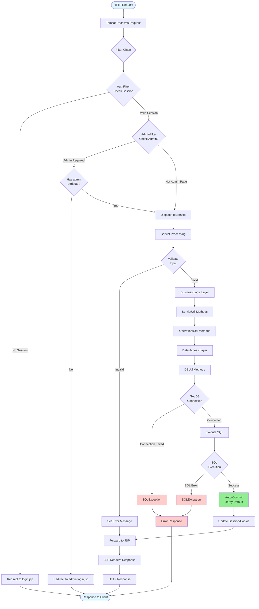
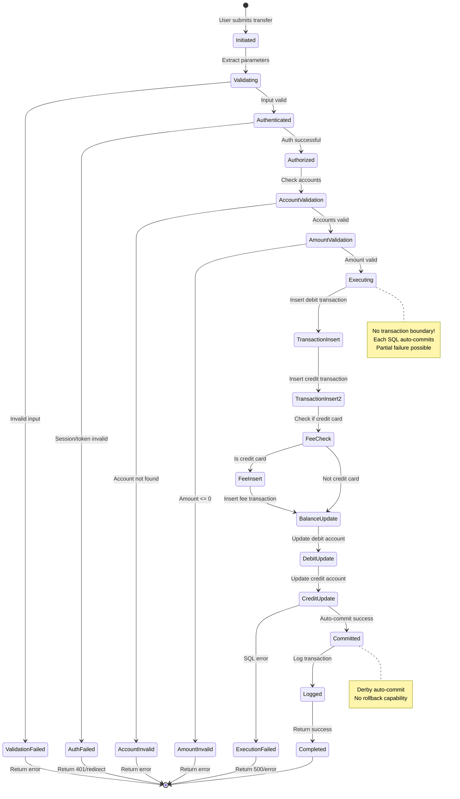
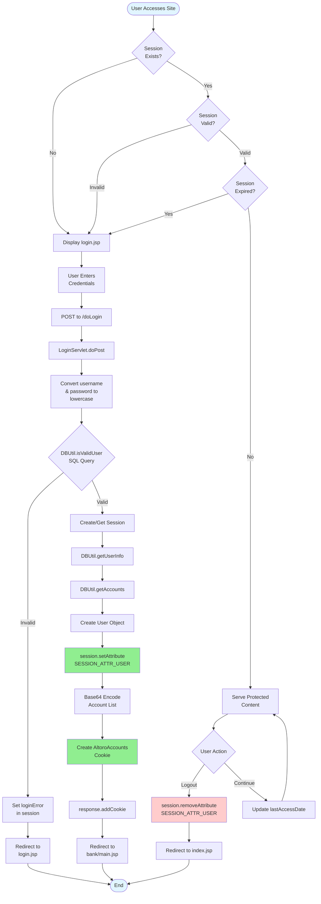
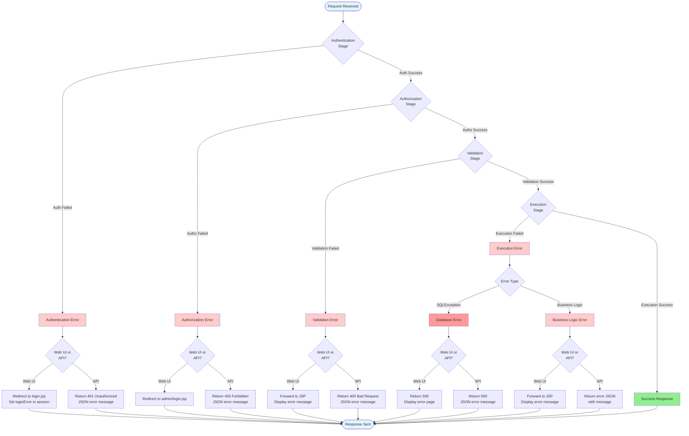
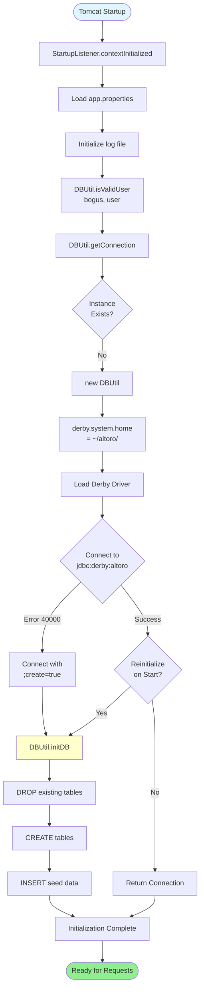

# AltoroJ Data Pipeline Analysis

## Executive Summary

This document provides a comprehensive analysis of data flow through the AltoroJ banking application, covering request lifecycles, transaction states, session management, error handling, consistency guarantees, audit trails, and database initialization. It includes detailed flowcharts showing complete data pipelines for both web UI and REST API paths.

---

## 1. Request Lifecycle

### 1.1 Web UI Request Lifecycle

#### Complete Flow: HTTP Request → Database Commit



**Key Insight**: Each SQL statement auto-commits immediately in Derby. There is NO transaction boundary, creating consistency risks during multi-statement operations like fund transfers.

### 1.2 REST API Request Lifecycle

#### Complete Flow: API Request → Database Commit

```mermaid
flowchart TD
    Start([HTTP API Request]) --> TomcatReceive[Tomcat Receives Request]
    TomcatReceive --> JerseyDispatch[Jersey JAX-RS Dispatcher]
    JerseyDispatch --> ApiAuthFilter{ApiAuthFilter<br/>Check Token}
    
    ApiAuthFilter -->|PermitAll| ResourceMethod[Resource Method]
    ApiAuthFilter -->|Requires Auth| ExtractToken{Extract<br/>Authorization<br/>Header}
    
    ExtractToken -->|Missing| Return401[Return 401<br/>Unauthorized]
    ExtractToken -->|Present| DecodeToken[Decode Base64 Token]
    
    DecodeToken --> ParseToken{Parse Token<br/>Format}
    ParseToken -->|Invalid Format| Return401
    ParseToken -->|Valid| ExtractCreds[Extract Username<br/>& Password]
    
    ExtractCreds --> ValidateDB{DBUtil.isValidUser<br/>SQL Query}
    ValidateDB -->|Invalid| Return401
    ValidateDB -->|Valid| ResourceMethod
    
    ResourceMethod --> ParseJSON{Parse JSON<br/>Request Body}
    ParseJSON -->|Invalid JSON| Return400[Return 400<br/>Bad Request]
    ParseJSON -->|Valid| ValidateParams{Validate<br/>Parameters}
    
    ValidateParams -->|Invalid| Return400
    ValidateParams -->|Valid| BusinessLogic[Business Logic]
    
    BusinessLogic --> OperationsUtil[OperationsUtil.doApiTransfer]
    OperationsUtil --> DBUtil[DBUtil.transferFunds]
    
    DBUtil --> GetConnection{Get DB<br/>Connection}
    GetConnection -->|Failed| Return500[Return 500<br/>Internal Error]
    
    GetConnection -->|Success| ValidateAccounts{Validate<br/>Accounts Exist}
    ValidateAccounts -->|Invalid| ReturnError[Return Error<br/>Message]
    
    ValidateAccounts -->|Valid| ExecuteTransfer[Execute Transfer<br/>SQL Statements]
    ExecuteTransfer --> InsertDebit[INSERT debit<br/>transaction]
    InsertDebit --> InsertCredit[INSERT credit<br/>transaction]
    InsertCredit --> CheckCreditCard{From Credit<br/>Card?}
    
    CheckCreditCard -->|Yes| InsertFee[INSERT cash<br/>advance fee]
    InsertFee --> UpdateBalances[UPDATE account<br/>balances]
    CheckCreditCard -->|No| UpdateBalances
    
    UpdateBalances --> AutoCommit[Auto-Commit]
    AutoCommit --> LogTransaction[Log to<br/>Log4AltoroJ]
    LogTransaction --> FormatJSON[Format JSON<br/>Response]
    
    FormatJSON --> Return200[Return 200 OK<br/>with JSON]
    Return200 --> End([Response to Client])
    
    Return401 --> End
    Return400 --> End
    Return500 --> End
    ReturnError --> End
    
    style Start fill:#e1f5ff
    style End fill:#e1f5ff
    style AutoCommit fill:#90EE90
    style Return401 fill:#ffcccc
    style Return400 fill:#ffcccc
    style Return500 fill:#ffcccc
    style ReturnError fill:#ffcccc
```



---

## 2. Transaction States

### 2.1 Transfer Transaction State Machine



**Critical Issue**: The lack of transaction boundaries means that if any step fails after the first INSERT, the database will be left in an inconsistent state with no ability to rollback.

---

## 3. Session Management

### 3.1 Session Lifecycle



**Session Data Structure:**
- **User Object**: Contains username, firstName, lastName, role, lastAccessDate
- **Admin Attribute**: Set to "altoroadmin" for admin users
- **AltoroAccounts Cookie**: Base64-encoded list of accounts (format: `accountId~name~balance|...`)

---

## 4. Error Handling

### 4.1 Comprehensive Error Handling Flow



**Key Error Scenarios:**
1. **Authentication Failure**: Invalid credentials → 401 or redirect to login
2. **Authorization Failure**: Insufficient privileges → 403 or redirect to admin login
3. **Validation Failure**: Invalid parameters → 400 or error message
4. **Execution Failure**: Database/business logic error → 500 or error message

**Critical Gap**: No rollback mechanism for partial transaction failures.

---

## 5. Consistency Guarantees

### 5.1 Current State: NO ACID Guarantees

**The Problem:**
```java
// DBUtil.transferFunds() - NO TRANSACTION BOUNDARY
statement.execute("INSERT INTO TRANSACTIONS (debit)");  // Commits immediately
statement.execute("INSERT INTO TRANSACTIONS (credit)"); // Commits immediately  
statement.execute("UPDATE ACCOUNTS (debit)");           // Commits immediately
statement.execute("UPDATE ACCOUNTS (credit)");          // Commits immediately

// If any statement fails, previous commits persist
// Result: Inconsistent database state with NO ROLLBACK
```

**Consistency Issues:**
1. ❌ No transaction boundary
2. ❌ No balance validation
3. ❌ No concurrent access control
4. ❌ No idempotency
5. ❌ No rollback capability

**What SHOULD Be Implemented:**
```java
connection.setAutoCommit(false);
try {
    // All operations
    statement.execute("INSERT...");
    statement.execute("UPDATE...");
    connection.commit(); // All or nothing
} catch (SQLException e) {
    connection.rollback(); // Undo all changes
}
```

---

## 6. Audit Trail

### 6.1 What is Logged

**TRANSACTIONS Table:**
- ✅ Transaction ID (auto-generated)
- ✅ Account ID
- ✅ Timestamp
- ✅ Transaction type
- ✅ Amount

**Log4AltoroJ:**
- ✅ Successful transfers
- ✅ Login failures
- ✅ Database errors
- ✅ Initialization errors

### 6.2 What is NOT Logged

**Critical Gaps:**
- ❌ User who initiated transaction
- ❌ Source IP address
- ❌ Session ID
- ❌ Related transaction ID (for transfers)
- ❌ Before/after balances
- ❌ Authorization method (web/API)
- ❌ Admin operations
- ❌ Password changes
- ❌ Account modifications

**Compliance Impact**: Does NOT meet PCI-DSS, SOX, GDPR, GLBA, or ISO 27001 requirements.

---

## 7. Database Initialization

### 7.1 Initialization Trigger



**Database Location**: `~/altoro/` (user home directory, NOT project directory)

**Initialization Modes:**
1. **First Startup**: Database doesn't exist → auto-creates with seed data
2. **Subsequent Startups**: Database exists → uses existing data
3. **Force Reinit**: Set `database.reinitializeOnStart=true` → drops and recreates

---

## Summary

This analysis reveals several critical architectural issues in AltoroJ:

1. **No Transaction Management**: Each SQL statement auto-commits, creating consistency risks
2. **Insufficient Error Handling**: No rollback capability for partial failures
3. **Weak Session Security**: Base64 encoding instead of encryption
4. **Inadequate Audit Trail**: Missing user attribution, IP tracking, and balance history
5. **No Consistency Guarantees**: Race conditions and negative balances possible

These issues are **intentional** as AltoroJ is designed as a vulnerable application for security training purposes.

---

*Document Version: 1.0 | Last Updated: 2026-03-29*